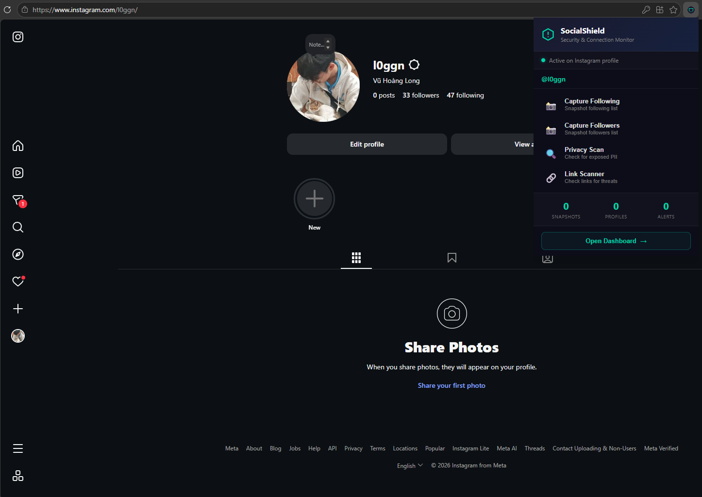
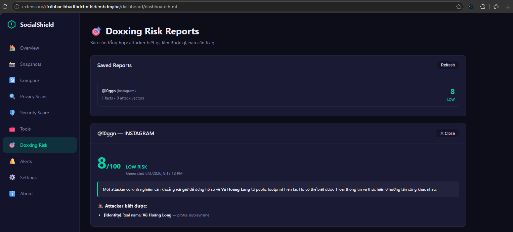
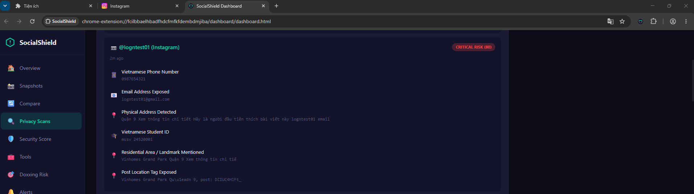
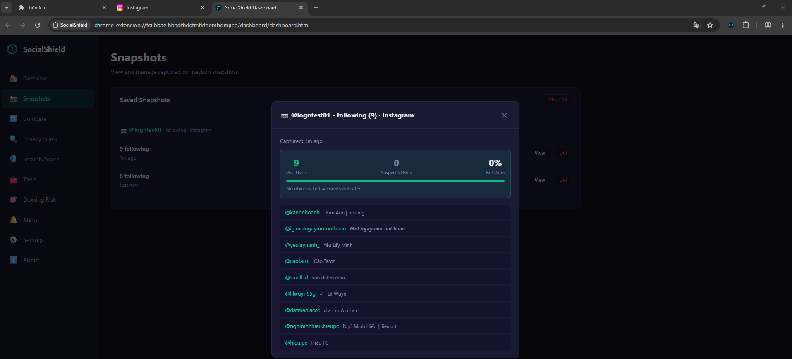
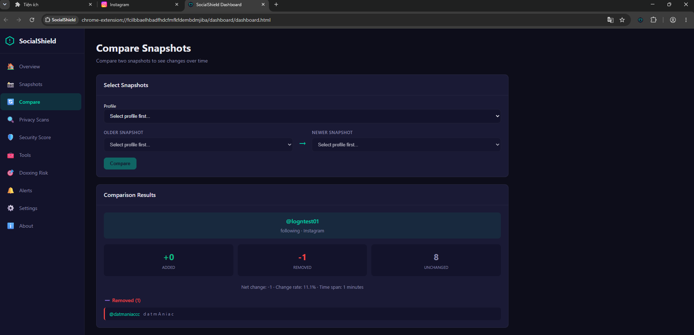
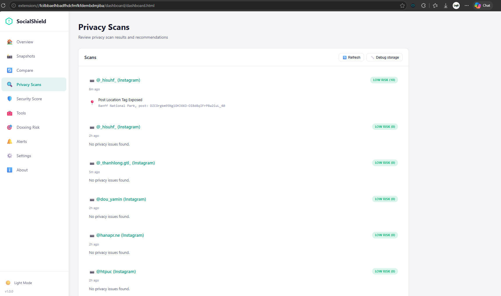
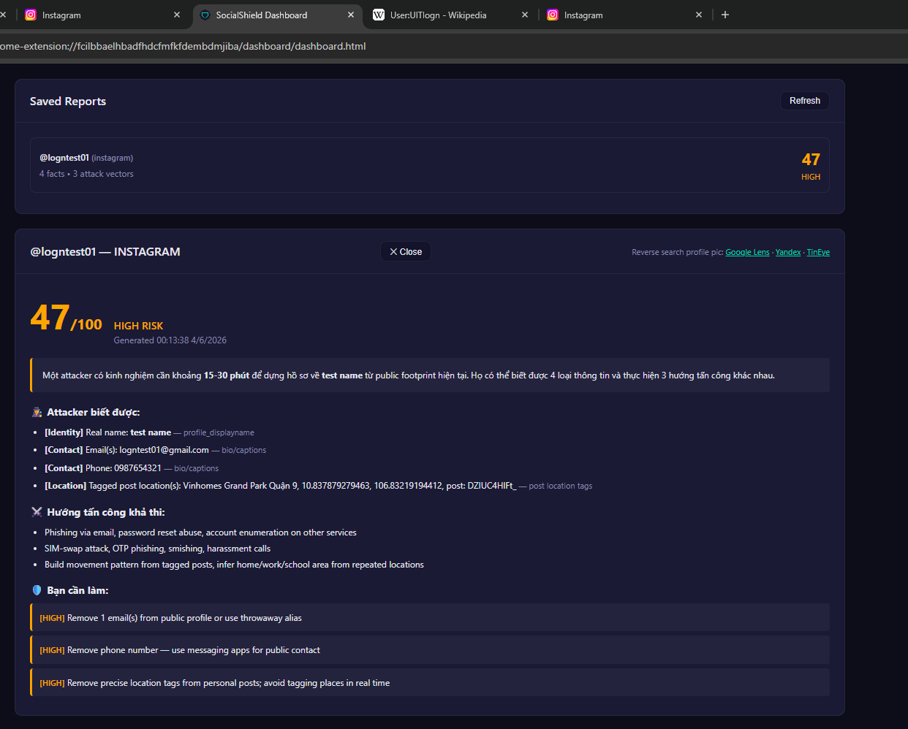
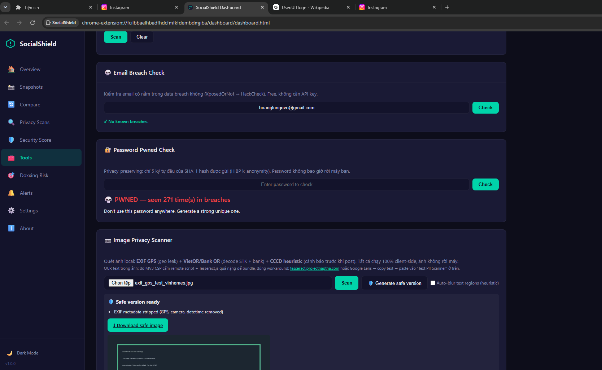

# Kế hoạch và kết quả kiểm thử SocialShield

## 1. Mục tiêu kiểm thử

Mục tiêu của quá trình kiểm thử là đánh giá SocialShield ở góc độ một công cụ bảo mật chạy trong trình duyệt, không chỉ kiểm tra giao diện có hoạt động hay không mà còn xác minh các cơ chế phát hiện rủi ro có phản hồi đúng với những tình huống tấn công thường gặp trên mạng xã hội.

Các nhóm rủi ro được tập trung kiểm thử gồm:

- Rò rỉ thông tin cá nhân công khai trên profile, bio, caption hoặc đoạn văn bản người dùng nhập.
- Liên kết lừa đảo, giả mạo domain, URL rút gọn và URL có dấu hiệu phishing.
- Nội dung scam/social engineering trong tin nhắn, comment hoặc bài đăng.
- Tài khoản giả mạo dựa trên username, display name và ảnh đại diện.
- Rủi ro doxxing từ việc tổng hợp nhiều dấu hiệu rò rỉ.
- Rủi ro mật khẩu đã từng xuất hiện trong cơ sở dữ liệu bị lộ.
- Rủi ro quyền riêng tư trong ảnh, gồm EXIF GPS, QR thanh toán và giấy tờ cá nhân.

## 2. Phạm vi kiểm thử

SocialShield là Chrome Extension Manifest V3, do đó phạm vi kiểm thử được chia thành hai nhóm.

### 2.1. Kiểm thử logic lõi

Nhóm này kiểm thử các hàm JavaScript có thể chạy độc lập, chủ yếu trong `lib/scanner.js`:

- `scanPrivacy()`: phát hiện thông tin cá nhân.
- `checkLink()`: đánh giá độ an toàn của URL.
- `detectImpersonation()`: phát hiện tài khoản nghi giả mạo.
- `generateDoxxingReport()`: tổng hợp rủi ro thành báo cáo doxxing.

### 2.2. Kiểm thử tích hợp trên trình duyệt

Nhóm này kiểm thử các chức năng phụ thuộc môi trường Chrome Extension:

- Load extension bằng `chrome://extensions`.
- Popup UI.
- Dashboard UI.
- Content script trên Instagram/X.
- Message passing giữa popup, content script, dashboard và background service worker.
- Lưu dữ liệu bằng `chrome.storage.local`.
- Các công cụ trong dashboard như Privacy Scan, URL Safety Check, Text PII Scanner, Password Pwned Check và Image Privacy Scanner.

## 3. Phương pháp kiểm thử

Quá trình kiểm thử sử dụng phương pháp kiểm thử theo tình huống tấn công thực tế. Thay vì chỉ dùng dữ liệu hợp lệ, các payload được thiết kế để mô phỏng cách attacker hoặc người dùng bất cẩn có thể tạo ra rủi ro:

- Bio có email, số điện thoại, CCCD, MSSV, số tài khoản, địa chỉ cụ thể.
- URL giả mạo Instagram hoặc Twitter/X.
- URL HTTP không mã hóa.
- URL rút gọn che giấu đích thật.
- Nội dung dụ xác minh tài khoản, nhận follower miễn phí, đầu tư crypto lợi nhuận cao.
- Username gần giống tài khoản gốc như thêm `official`, `real`, `_backup` hoặc thay ký tự `o` thành `0`.
- Ảnh có metadata vị trí hoặc QR thanh toán.

Mỗi test case được đánh giá theo bốn tiêu chí:

1. Extension có chạy ổn định, không crash.
2. Kết quả phát hiện có đúng nhóm rủi ro chính không.
3. Mức độ nghiêm trọng có hợp lý không.
4. Nếu có API ngoài bị lỗi hoặc không cấu hình, hệ thống có fallback hoặc thông báo phù hợp không.

## 4. Kết quả kiểm thử logic lõi

Các kiểm thử hồi quy tối thiểu được thực hiện trực tiếp trên module scanner để xác minh các hàm phát hiện chính.

| Mã kiểm thử | Chức năng | Dữ liệu kiểm thử | Kết quả mong đợi | Kết quả ghi nhận |
|---|---|---|---|---|
| CORE-01 | Privacy Scanner | Văn bản chứa email, số điện thoại Việt Nam, MSSV | Phát hiện `email`, `phone_vn`, `vn_student_id` | Đạt |
| CORE-02 | Privacy Scanner | Văn bản chứa CCCD và API token | Phát hiện `national_id`, `api_token` với rủi ro cao/nghiêm trọng | Đạt |
| CORE-03 | Link Scanner | `http://1nstagram-login-verify.com/free-followers` | URL bị đánh dấu không an toàn, có dấu hiệu typosquatting/phishing/scam | Đạt |
| CORE-04 | Link Scanner | `https://www.instagram.com/` | URL hợp lệ, không bị đánh dấu nguy hiểm | Đạt |
| CORE-05 | Impersonation Detection | Tài khoản `socialshield_official` với display name giống target | Bị đưa vào danh sách nghi giả mạo | Đạt |
| CORE-06 | Doxxing Report | Profile có email, CCCD, địa chỉ, breach và footprint | Sinh risk score cao, có attacker narrative và khuyến nghị xử lý | Đạt |

Kết quả kiểm thử logic lõi cho thấy các thành phần phát hiện chính hoạt động đúng với payload cơ bản và có thể phân biệt được dữ liệu bình thường với dữ liệu có rủi ro rõ ràng.

## 5. Kiểm thử Privacy Scanner

### 5.1. Bản chất kiểm thử

Privacy Scanner được kiểm thử bằng cách đưa vào các đoạn văn bản mô phỏng bio, caption hoặc nội dung bài đăng có chứa thông tin cá nhân. Mục tiêu là xác minh khả năng phát hiện PII và phân loại mức độ nghiêm trọng.

### 5.2. Nhóm dữ liệu kiểm thử

| Nhóm dữ liệu | Ví dụ rủi ro | Ý nghĩa bảo mật |
|---|---|---|
| Email | `test.user@example.com` | Có thể bị spam, phishing, credential stuffing |
| Số điện thoại Việt Nam | `0901234567` | Có thể bị SIM-swap, spam, dò danh tính |
| CCCD/CMND | Chuỗi 12 số bắt đầu bằng `0` | Rủi ro định danh cá nhân nghiêm trọng |
| MSSV | `MSSV: 22520001` | Có thể liên kết tới trường/lớp/hệ thống sinh viên |
| Số tài khoản/payment handle | `stk`, `MoMo`, `ZaloPay`, `VietQR` | Có thể bị lợi dụng trong lừa đảo chuyển khoản |
| Địa chỉ chi tiết | Số nhà, đường, phường/quận | Rủi ro stalking, doxxing, swatting |
| API token | `ghp_...`, `sk_live...` | Có thể dẫn tới chiếm quyền hệ thống |

### 5.3. Kết quả

Privacy Scanner phát hiện đúng các mẫu PII chính. Các pattern nhạy cảm được thiết kế có điều kiện ngữ cảnh để giảm false positive, ví dụ MSSV cần có từ khóa `MSSV`, tài khoản ngân hàng cần có ngữ cảnh `stk` hoặc `số tài khoản`, hộ chiếu cần có ngữ cảnh liên quan giấy tờ.

Kết quả này cho thấy chức năng phù hợp với mục tiêu self-audit: cảnh báo sớm cho người dùng khi họ công khai quá nhiều thông tin trên mạng xã hội.

## 6. Kiểm thử Link Scanner

### 6.1. Bản chất kiểm thử

Link Scanner được kiểm thử bằng các URL mô phỏng phishing và malware delivery. Hệ thống đánh giá URL theo cả heuristic cục bộ và threat intelligence API nếu được cấu hình.

### 6.2. Nhóm URL kiểm thử

| Nhóm URL | Dấu hiệu | Kết quả mong đợi |
|---|---|---|
| Domain hợp lệ | `https://www.instagram.com/` | Không cảnh báo nguy hiểm |
| HTTP không mã hóa | `http://...` | Cảnh báo không dùng HTTPS |
| Typosquatting | `1nstagram`, `twltter` | Cảnh báo giả mạo domain |
| Phishing keyword | `login`, `verify`, `password`, `account` | Tăng điểm rủi ro |
| Scam keyword | `free-followers`, `blue-badge`, `hack-instagram` | Cảnh báo scam |
| URL shortener | `bit.ly`, `tinyurl.com`, `t.co` | Cảnh báo đích đến bị che giấu |
| IP address | URL dùng IP thay vì domain | Cảnh báo bất thường |

### 6.3. Kết quả

URL giả mạo rõ ràng như `http://1nstagram-login-verify.com/free-followers` bị đánh dấu không an toàn. URL chính thống như `https://www.instagram.com/` vẫn được giữ ở trạng thái an toàn.

Kết quả này chứng minh heuristic cục bộ có thể phát hiện các dấu hiệu phishing phổ biến ngay cả khi chưa cấu hình API key cho Google Safe Browsing hoặc VirusTotal.

## 7. Kiểm thử Text Scam Detection

### 7.1. Bản chất kiểm thử

Text Scam Detection được kiểm thử bằng các đoạn văn bản thường xuất hiện trong lừa đảo mạng xã hội:

- Yêu cầu xác minh tài khoản.
- Cảnh báo tài khoản bị khóa.
- Kêu gọi bấm link khẩn cấp.
- Hứa hẹn follower miễn phí.
- Lừa đầu tư crypto.
- Giả danh bộ phận hỗ trợ.

### 7.2. Kết quả

Khi AI server không được cấu hình, hệ thống vẫn có thể phân tích bằng rule-based fallback. Các nội dung có dấu hiệu rõ như `verify your account`, `account suspended`, `free followers`, `guaranteed returns`, `double your investment` được phân loại là `suspicious` hoặc `scam`.

Ý nghĩa của kết quả này là SocialShield không phụ thuộc hoàn toàn vào AI. Khi AI server lỗi, không chạy hoặc không có API key, extension vẫn giữ được khả năng cảnh báo cơ bản.

## 8. Kiểm thử Password Pwned Check

### 8.1. Bản chất kiểm thử

Password Pwned Check được đánh giá dựa trên cơ chế k-anonymity của HIBP Pwned Passwords:

```text
Password
-> SHA-1 hash trên client
-> gửi 5 ký tự đầu của hash
-> nhận danh sách suffix
-> so khớp phần còn lại ở client
```

### 8.2. Ý nghĩa bảo mật

Cơ chế này đảm bảo:

- Không gửi mật khẩu gốc ra ngoài.
- Không gửi toàn bộ hash ra ngoài.
- API bên ngoài không biết chính xác mật khẩu người dùng đang kiểm tra.

Khi kiểm thử bằng mật khẩu phổ biến, hệ thống có thể phát hiện mật khẩu từng xuất hiện trong breach database. Khi kiểm thử bằng chuỗi ngẫu nhiên dài, kết quả có xu hướng an toàn hơn.

## 9. Kiểm thử Impersonation Detection

### 9.1. Bản chất kiểm thử

Chức năng phát hiện giả mạo được kiểm thử bằng danh sách tài khoản mô phỏng có username/display name gần giống tài khoản gốc.

Các kỹ thuật giả mạo được mô phỏng:

- Thêm hậu tố `_official`, `_backup`.
- Thêm tiền tố `real_`, `official_`.
- Thay ký tự giống nhau như `o` thành `0`, `l` thành `1`.
- Dùng display name giống hệt tài khoản gốc.
- Dùng avatar ẩn danh để tăng độ nghi ngờ.

### 9.2. Kết quả

Các tài khoản có username hoặc display name gần giống target được đưa vào danh sách nghi giả mạo với `impersonationScore` phù hợp. Hệ thống cũng ghi lại lý do nghi ngờ như username tương tự, character swap, display name giống hoặc không có ảnh đại diện.

Kết quả này phù hợp với mục tiêu phát hiện sớm tài khoản mạo danh dùng trong lừa đảo follower hoặc phishing.

## 10. Kiểm thử Doxxing Report

### 10.1. Bản chất kiểm thử

Doxxing Report được kiểm thử bằng cách tổng hợp nhiều loại finding:

- Email.
- CCCD.
- Địa chỉ chi tiết.
- Dữ liệu breach.
- Footprint username trên nhiều nền tảng.

### 10.2. Kết quả

Hệ thống tạo được:

- Risk score.
- Risk tier.
- Narrative theo góc nhìn attacker.
- Danh sách thông tin attacker có thể biết.
- Danh sách hướng tấn công khả thi.
- Danh sách hành động khắc phục.

Ý nghĩa của kiểm thử này là xác minh SocialShield không chỉ phát hiện từng lỗi riêng lẻ, mà còn có khả năng tổng hợp nhiều tín hiệu thành một báo cáo rủi ro dễ hiểu cho người dùng.

## 11. Kiểm thử Image Privacy Scanner

### 11.1. Bản chất kiểm thử

Image Privacy Scanner được kiểm thử bằng các ảnh mẫu có khả năng chứa thông tin nhạy cảm:

- Ảnh JPEG có EXIF GPS.
- Ảnh chứa QR/VietQR.
- Ảnh có dạng giấy tờ tùy thân.
- Ảnh cần tạo bản an toàn trước khi chia sẻ.

### 11.2. Kết quả mong đợi

Khi ảnh có metadata GPS, hệ thống cần cảnh báo rò rỉ vị trí. Khi ảnh có QR thanh toán, hệ thống cần cảnh báo rủi ro liên quan thông tin tài chính. Khi tạo safe image, hệ thống cần loại bỏ metadata và che vùng QR nếu phát hiện được.

Nhóm kiểm thử này có ý nghĩa thực tế cao vì nhiều người dùng vô tình chia sẻ ảnh chứa vị trí, QR hoặc giấy tờ cá nhân mà không nhận ra.

## 12. Kiểm thử tích hợp giao diện

Các luồng giao diện được kiểm thử gồm:

- Load extension bằng Chrome Developer Mode.
- Mở popup từ icon extension.
- Mở dashboard.
- Chạy các công cụ trong dashboard.
- Chạy content script trên Instagram/X.
- Kiểm tra dữ liệu sau khi quét được lưu và hiển thị lại.

Kết quả ghi nhận:

- Popup và dashboard có thể mở bình thường.
- Các công cụ scanner hoạt động độc lập trong dashboard.
- Content script có thể inject vào các trang khớp `manifest.json`.
- Background service worker nhận message và xử lý các tác vụ nền.

## 13. Nhận xét về độ tin cậy

Các kết quả kiểm thử cho thấy SocialShield đáp ứng được mục tiêu phát hiện rủi ro phổ biến trên mạng xã hội ở mức proof-of-concept có khả năng sử dụng thực tế.

Tuy nhiên, hệ thống vẫn có một số giới hạn:

- Regex có thể false positive hoặc false negative.
- Instagram/X có thể thay đổi DOM hoặc API làm content script cần cập nhật.
- Các API bên ngoài có thể rate limit hoặc yêu cầu API key.
- Một số cảnh báo như impersonation hoặc CCCD heuristic cần người dùng kiểm tra lại thủ công.
- Chưa có dataset lớn để đo precision/recall một cách định lượng.

## 14. Kết luận

Quá trình kiểm thử tập trung vào các rủi ro bảo mật thực tế thay vì chỉ kiểm tra giao diện. Các test case đã xác minh được những chức năng quan trọng nhất của SocialShield:

- Phát hiện PII trong nội dung công khai.
- Cảnh báo URL phishing/scam.
- Phân loại nội dung scam bằng AI hoặc rule-based fallback.
- Kiểm tra mật khẩu theo cơ chế k-anonymity.
- Phát hiện tài khoản nghi giả mạo.
- Tổng hợp rủi ro thành Doxxing Report.
- Đánh giá rủi ro quyền riêng tư trong ảnh.

Kết quả này cho thấy đồ án có giá trị như một công cụ hỗ trợ người dùng tự đánh giá an toàn tài khoản mạng xã hội, đồng thời thể hiện được các kiến thức cốt lõi của lập trình Web: HTML/CSS/JavaScript, DOM, HTTP API, JSON, async programming, Chrome Extension APIs, storage, security và privacy-by-design.

## 15. Hình ảnh kiểm thử

Test extension hoạt động trên cả chrome và edge
popup:

dashboard:


Tạo tài khoản giả để cố tình lộ thông tin tron bio/bài viết/caption. Kết quả scan:



Kết quả capture following:


Kết quả so sánh diff sau khi thử unfollow một người:


Toggle light/dark mode cho dashboard:


Test Doxxing Risk:


Test các tính năng trong Tools:
